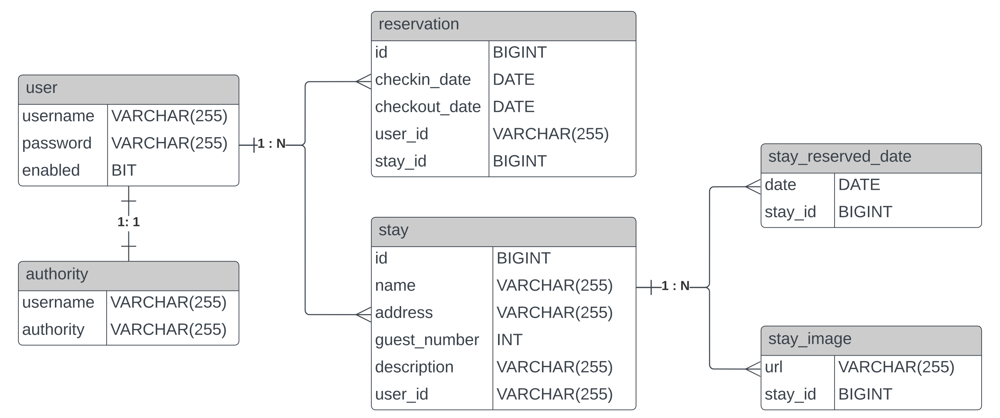

## CosmosCabin: A Geolocation-based Full Stack Cabin Vacation Rental Web Application  
+ [1. Introduction](#1-introduction)
+ [2. Database](#2-Database)
+ [3. Virtual Environment Setup](#3-Virtual-Environment-Setup)
+ [4. Models](#4-Models)

### 1. Introduction
* Demo on Youtube: https://youtu.be/l6sAhDGgtC0
* Developed an user-friendly web page with React JS and Ant Design.

* Implemented backend services via Spring Boot to support cabin management and reservation. 

* Utilized Spring JPA to access and operate data stored in MySQL Database on Amazon RDS.

* Utilized Google Cloud Storage to store media files of the uploaded cabin rental information.

* Implemented geolocation-based search by utilizing Elasticsearch on Google Cloud Compute Engine.

* Improved security by using token-based authentication and server-side authorization via Spring Security.

* Deployed the services on the Google App Engine for better scalability and reliability.
  \
  \
  \
  Link to frontend depository: https://github.com/xiaorandu/cosmoscabin_frontend
### 2. Database

