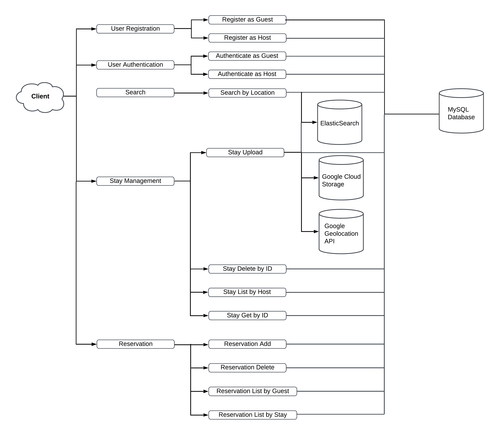

## CosmosCabin: A Geolocation-based Full Stack Cabin Vacation Rental Web Application  
+ [1. Introduction](#1-introduction)
+ [2. Backend Overview](#2-Backend-Overview)
+ [3. Database Schema](#3-Database-Schema)
+ [4. Models](#4-Models)

### 1. Introduction
+ **Technologies: Java, JavaScript, Spring Boot, React JS, Hibernate, MySQL, Elasticsearch, Google Cloud Storage**
+ Developed a cabin vacation rental web application with a **React JS** frontend and a **Spring Boot** backend, enabling cabin management and reservation services. Deployed the backend services on **Google App Engine**. 
+ Utilized **MySQL** and **Google Cloud Storage** for data storage, with **Hibernate** handling ORM and data operations.
+ Implemented geolocation-based search by utilizing **Elasticsearch**, deployed on **Google Cloud Compute Engine**.
+ Implemented **token-based** server side user authentication based on the **Spring Security framework**.
+ Demo video: https://youtu.be/l6sAhDGgtC0

+ Link to frontend depository: https://github.com/xiaorandu/cosmoscabin_frontend

### 2. Backend Overview

### 3. Database Schema

